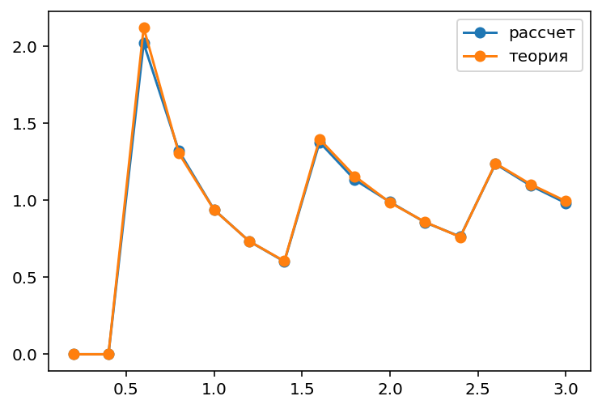

# Проект: Исследование эффекта Парселла в планарном резонаторе (1D)

## Описание

Данный проект представляет собой численное моделирование электромагнитных явлений с использованием библиотеки Meep (MIT Electromagnetic Equation Propagation).
В работе исследуется зависимость фактора Парселла от толщины планарного металлического резонатора с дипольным источником.

## Теоретическая основа

Эффект Парселла описывает модификацию скорости спонтанного излучения диполя, помещённого в резонатор, по сравнению с излучением в свободном пространстве.
Фактор Парселла (FP) обратно пропорционален объему моды и прямо пропорционален её добротности.

## Модель

*   **Геометрия**: 1D Резонатор, 2D Геометрия, Цилиндрическая симметрия задачи
*   **Размер среды**: по z = 10.0 мкм, по R = 5.0 мкм
*   **Граничные условия**: PML толщиной 1.0 мкм / Идеальный проводник (PEC)
*   **Источник**: Тип источника: точечный диполь, гауссов импульс. Его параметры: центральная частота/длина волны, ширина полосы
*   **Материалы**: Среда с показателем преломления 2.4, резонатор Фабри-Перо
*   **Мониторы**: Измеряется LDOS в точке расположения источника

## Параметры расчёта

| Параметр | Значение |
| :--- | :--- |
| Разрешение (resolution) | `70` пикселей/мкм |
| Центральная частота/длина волны (λ) | `1` мкм / `1` МГц |
| Ширина импульса (fwidth) | `200 кГц` |
| Время симуляции (run time) | `until_after_sources=5` |
| Диапазон сканирования параметра | `nL/λ = 0.6 ... 3.0, шаг 0.2` |

## Результаты

### Зависимость фактора Парселла от нормированной толщины 



*Рисунок 1: Сравнение численного расчёта F_P(nL/λ) с аналитической теорией (IEEE 1998)*

### Анализ зависимости

На полученном графике отчётливо видны резонансные пики фактора Парселла при значениях нормированной толщины `nL/λ ≈ 0.5, 1.5, 2.5`, что соответствует условию резонанса в планарном резонаторе. В максимумах численное значение `F_P` достигает `2.0,1.4,1.3`, что хорошо согласуется с аналитической теорией.

При увеличении толщины резонатора наблюдается снижение максимального значения `F_P`, что объясняется увеличением объёма резонаторной моды.

## Выводы

1.  **Подтверждение эффекта:** Моделирование показало, что помещение диполя в планарный резонатор приводит к значительному (в `1.3-2.0` раз) увеличению LDOS на резонансных частотах по сравнению с однородной средой.
2.  **Согласие с теорией:** Полученная численная зависимость фактора Парселла от нормированной толщины `nL/λ` хорошо совпадает с аналитической формулой из статьи IEEE J. Quantum Electronics, Vol. 34, pp. 71-76 (1998), что подтверждает корректность модели.
3.  **Физические закономерности:** Максимальное усиление достигается при наименьшей моде резонатора (`nL/λ ≈ 0.5`). Положения пиков соответствуют резонансным условиям, а их уширение и снижение при увеличении `nL/λ` связано с волновыми свойствами электромагнитной волны.
4.  **Методика:** Продемонстрирована эффективность использования подхода `dft_ldos` в библиотеке Meep для расчёта парселловского усиления в резонансных структурах.

## Требования

Для запуска кода необходимы следующие библиотеки:

```bash
numpy
matplotlib
meep
